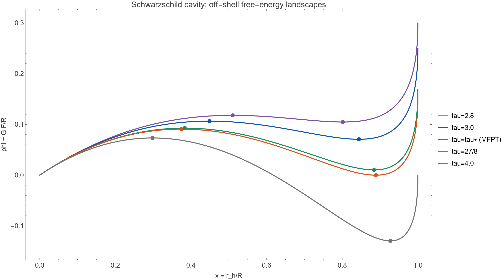
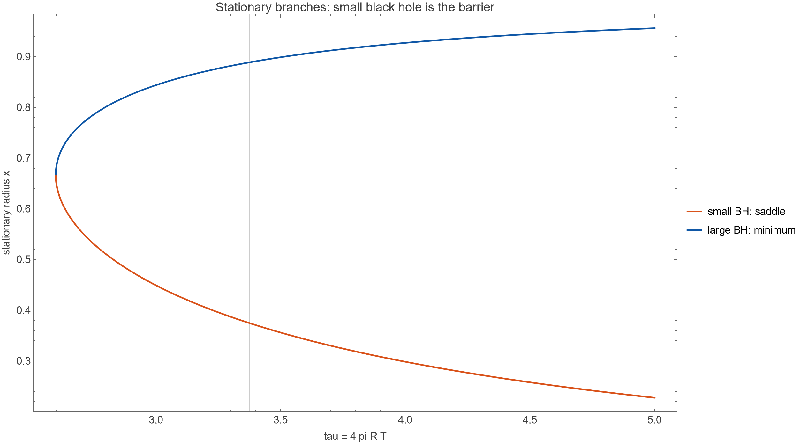
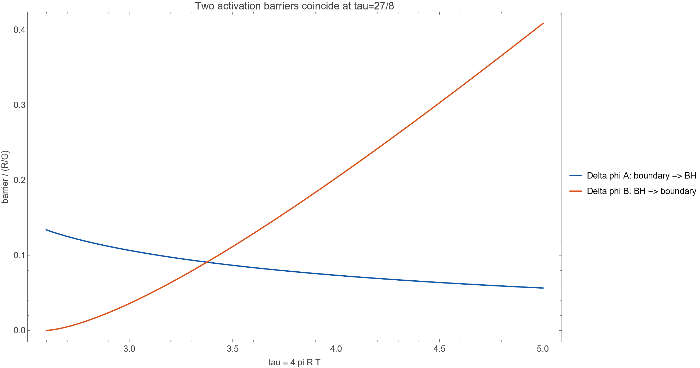
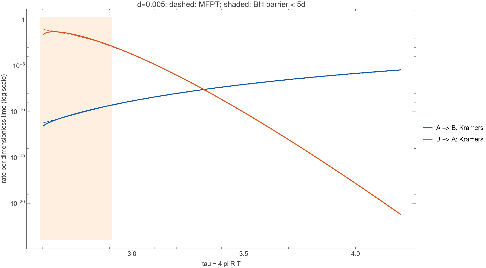
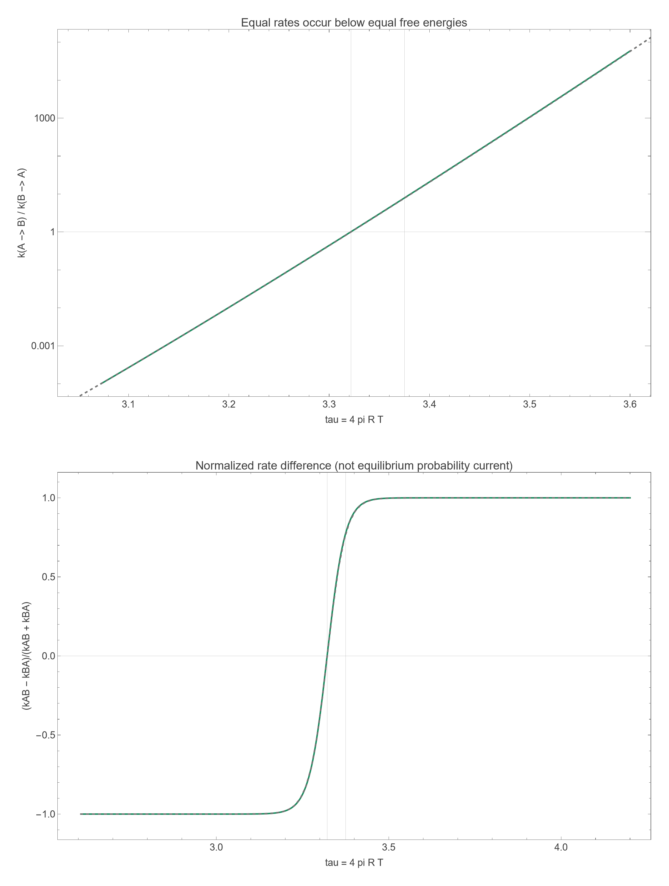

## 0. 范围与文献边界

本文只使用 arXiv:2211.03512（下称 2211）和 arXiv:2607.03749（下称 2607）。2211 研究四维 RN–AdS 黑洞；2607 正文研究有限球形腔中的渐近平坦 Schwarzschild 黑洞。2607 结论把 charged black hole 列为推广方向之一，并未给出 RN 腔的显式热力学公式。因此，Schwarzschild 腔部分是 2607 原文结果；RN 腔部分是基于 Einstein–Maxwell 度规和 Brown–York 能量的独立推导。

下文除特别说明外取 $G=1$（2211 的约定）；在保留 $G$ 的腔公式中，RN 几何电荷记为 $q^2=GQ^2$，并采用 $4\pi\epsilon_0=1$。

## 1. 2211 的 RN–AdS 热势框架

2211, Sec. II, Eqs. (1)–(4)（源码 PTR2209.tex 行 62–76）给出

$$
M=\frac{r_h}{2}+\frac{4\pi P r_h^3}{3}+\frac{Q^2}{2r_h},\qquad
T_h=\frac{1+8\pi P r_h^2-Q^2/r_h^2}{4\pi r_h},
$$


$$
S=\pi r_h^2,\qquad
G=M-T_hS=\frac14\left(r_h-\frac{8\pi}{3}Pr_h^3+\frac{3Q^2}{r_h}\right).
$$

注：式 (1) 的 $Q^2$ 项分母在原文中（源码行 63、HTML、PDF 三处一致）印作 $2r_h^2$，与同文式 (2)(4)(5) 及量纲均不自洽，应为笔误；本文按自洽形式 $2r_h$ 书写。

临界量（2211, Eq. (5), 源码行 80–82）为

$$
r_c=\sqrt6Q,\qquad T_c=\frac{\sqrt6}{18\pi Q},\qquad P_c=\frac{1}{96\pi Q^2},\qquad G_c=\frac{\sqrt6Q}{3}.
$$

定义 $x=r_h/r_c,\ p=P/P_c,\ t=T/T_c$。将上述温度代入可得

$$
t_h(x,p)=\frac{3}{4x}+\frac{3p}{8}x-\frac{1}{8x^3}.
$$

2211 的非平衡热势定义为（Sec. II, Eq. (7), 源码行 90–92）

$$
f=\int (T_h-T)\,dS,
$$

并明确说明其极值对应平衡态。由于在固定 $Q,P$（正则系综）下 $dS=12\pi Q^2x\,dx$（若允许 $Q$ 变动，则还应补一项 $12\pi Qx^2\,dQ$，见 `arXiv-2211.03512v2/总结-电荷AdS黑洞相变速率.md` 的 Q7），积分得到（Eq. (8), 行 97–99）

$$
f=\frac{\sqrt6Q}{3}\psi(x),\qquad
\psi(x)=\frac{1}{4x}+\frac{3x}{2}+\frac{px^3}{4}-tx^2.
$$

求导得

$$
\frac{d\psi}{dx}=-\frac{1}{4x^2}+\frac32+\frac{3p}{4}x^2-2tx,
$$

故极值满足

$$
3px^4-8tx^3+6x^2-1=0,
$$

这与 2211 源码行 120–127 的根方程一致。对 $0<p<1$ 且 $t_1<t<t_3$，论文指出有三个正根 $x_1<x_2<x_3$：两端是势阱，中间是势垒。

因此 2211 可以定义两条 Kramers 速率（Eqs. (10)–(12), 源码行 122–124、138–141）

$$
r_{k1}=\frac{\sqrt{|f''(x_1)f''(x_2)|}}{2\pi}
\exp\!\left[-\frac{f(x_2)-f(x_1)}{D}\right],
$$


$$
r_{k2}=\frac{\sqrt{|f''(x_3)f''(x_2)|}}{2\pi}
\exp\!\left[-\frac{f(x_2)-f(x_3)}{D}\right].
$$

论文总结（源码行 162–175）指出速率在端点 $t_1$、$t_3$ 处趋零，存在 $t_*\in(t_2,t_3)$ 使两速率相等，并且小黑洞到大黑洞的转变总体占优。这些结论依赖 RN–AdS 的“双势阱+势垒”结构。

## 2. 直接替换为带腔 Schwarzschild 黑洞

### 2.1 2607 的原文热力学

2607, Sec. II（源码 v14.tex 行 99–124）取

$$
ds^2=-f(r)dt^2+f(r)^{-1}dr^2+r^2d\Omega_2^2,
\qquad f(r)=1-\frac{r_h}{r},
$$

并将腔壁放在 $r=R=r_B>r_h$。作者把腔壁视作全息屏，只讨论 Hartle–Hawking 热平衡。

第一定律是（2607 Eq. (3), 行 128–135）

$$
dE=T\,dS-P\,dV.
$$

熵和“体积”（几何上是腔壁面积）为（Eq. (4), 行 137–149）

$$
S=\frac{\pi r_h^2}{G},\qquad V=4\pi R^2.
$$

Brown–York 能量、Tolman 壁温和表面压强分别为（Eqs. (5)–(7), 行 151–168）

$$
E=\frac{R}{G}\left(1-\sqrt{1-\frac{r_h}{R}}\right),
$$


$$
T_B=\frac{1}{4\pi r_h\sqrt{1-r_h/R}},
$$


$$
P=\frac{1}{8\pi GR}\left[
\frac{1-r_h/(2R)}{\sqrt{1-r_h/R}}-1\right].
$$

2607 说明平直背景减法使 $r_h=0$ 时 $E=P=0$，而 $R\to\infty$ 时恢复 ADM 质量、Hawking 温度和 $dM=T_HdS$（行 170–171）。

### 2.2 替换后的 off-shell 热势

令

$$
x=\frac{r_h}{R},\qquad \tau=4\pi RT.
$$

取 $F(0)=0$，由 $F=E-TS$ 得

$$
\boxed{\frac{G F_R(x;T)}{R}=1-\sqrt{1-x}-\frac{\tau}{4}x^2}.
$$

求导：

$$
\frac{G}{R}\frac{\partial F_R}{\partial x}
=\frac{1}{2\sqrt{1-x}}-\frac{\tau x}{2}.
$$

所以极值条件为

$$
\tau x\sqrt{1-x}=1
\quad\Longleftrightarrow\quad
T=T_B.
$$

平方并恢复 $r_h$ 得

$$
r_h^3-Rr_h^2+\frac{R}{(4\pi T)^2}=0,
$$

这正是 2607 的温度三次方程（Eq. (10), 行 183–187）。

令 $d\tau/dx=0$，得到

$$
x_c=\frac23,\qquad \tau_c=\frac{3\sqrt3}{2},\qquad
RT_c=\frac{\sqrt{27}}{8\pi}.
$$

因此当 $RT>\sqrt{27}/(8\pi)$ 时有两条物理解：小支 $0<x<2/3$ 和大支 $2/3<x<1$（2607 Eq. (10) 后文字，行 189–197）。

稳定性可直接核验。由 $S=\pi R^2x^2/G$ 和 $T=1/[4\pi Rx\sqrt{1-x}]$，

$$
\frac{dT}{dx}=T\frac{3x-2}{2x(1-x)},
$$


$$
C_V=T\left(\frac{\partial S}{\partial T}\right)_R
=\frac{4\pi R^2x^2(1-x)}{G(3x-2)}.
$$

故 $x<2/3$ 时 $C_V<0$（不稳定），$x>2/3$ 时 $C_V>0$（稳定），与 2607 的原文判定一致。

### 2.3 原文依据、跃迁对象与必须补充的动力学假设

**下面显式计算“边界参考态 A ↔ 大黑洞 B”的两条速率，并给出势形、分支、势垒、速率和速率差图。** 小 Schwarzschild 黑洞是两者之间的势垒，而不是另一个稳定黑洞态。先区分原文热力学与新增的随机动力学。

本次逐页核对的是 **2211.03512v2（2023-03-06）** 与 **2607.03749v2（2026-08-05）** 的原始 PDF 和对应 HTML。保留原件为 [2211 原文 PDF](cavity_schwarzschild_rates/source_audit/2211.03512v2.pdf) 与 [2607 原文 PDF](cavity_schwarzschild_rates/source_audit/2607.03749v2.pdf)。本轮网络请求超时，故核验的是已有原论文副本，而非确认今日最新版本；没有使用其他 Markdown 作为研究依据。以下页码从 PDF 首页起计；[出处核验记录](cavity_schwarzschild_rates/source_audit/source_evidence.txt) 包含版本、水印、引文位置与文件 SHA256。

| 证据 | 原文位置及短引文 | 本节使用的内容 |
|---|---|---|
| A1 | 2211，第 3 页，式 (7)(8) | $f=\int(T_h-T)dS$ 的离壳热势构造 |
| A2 | 2211，第 4 页，式 (10) 后：“$D$ is the constant diffusion coefficient” | 常数噪声参数下的 Kramers 分析 |
| A3 | 2211，第 5 页，式 (11)(12)、图 3 | 两方向速率；图 3 取 $p=0.5,\ Q=10/\sqrt6,\ D=10$ |
| A4 | 2211，第 5 页，图 3 后：“the transition rates $r_{k1}$ and $r_{k2}$ are not equal” | 等势阱深度不一定等速率，须在新背景重新计算 |
| B1 | 2607，第 2 页，式 (4)–(7) | 熵、腔壁面积、Brown–York 能量、Tolman 温度与表面压强 |
| B2 | 2607，第 2 页，式 (8)(9)：$F=E-TS$、$dF=-S\,dT-P\,dV$ | 固定 $V=4\pi R^2$ 时使用 Helmholtz 自由能 |
| B3 | 2607，第 3 页，式 (10) 后分支讨论；第 15 页，式 (59) | 小支负热容，大支正热容；$C_V=4S(1-x)/(3x-2)$ |

2607 讨论准静态热机和平衡热力学，没有确定这里的随机迁移率、反射边界条件或成核前因子。以下用它的热力学函数，配合与 A2 的 Kramers 方法相容的一维过阻尼模型作**新增推导**。不能把这些速率误称为 2607 的原文结果。

固定 $R,G$，令

$$
F_0=\frac{R}{G},\qquad
\phi(x;\tau)=\frac{F_R}{F_0}
=1-\sqrt{1-x}-\frac{\tau x^2}{4},
\qquad \tau=4\pi RT.
\tag{S1}
$$

原文 AdS 压强参数 $p$ 在这里没有直接对应物：本节固定腔壁半径，2607 的表面压强由状态决定。原文 $D=10$ 也不能直接搬成这里的无量纲噪声。

将盆地与鞍点标为

$$
A:\ x=0,\qquad B:\ x=x_l,\qquad
\text{两者之间的鞍点}:\ x=x_s.
$$

$x=0$ 是平直背景减法下的零自由能参考端点。把它延拓为“热平直空间/辐射盆地”是一项有效模型假设：本节没有另算有限温度辐射气体的自由能、量子涨落或其反作用。因此 A 始终指这个明确定义的边界盆地，而不是已经包含全部辐射物理的成核态。

给定常数迁移率 $\mu_x>0$ 和有效噪声能标 $\Theta>0$，采用

$$
dx=-\mu_x\,\partial_xF_R\,dt_{\rm phys}
+\sqrt{2\mu_x\Theta}\,dW_{t_{\rm phys}}.
$$

定义

$$
s=\mu_xF_0t_{\rm phys},\qquad d=\frac{\Theta}{F_0},
$$

得到

$$
\boxed{dx=-\phi'(x)\,ds+\sqrt{2d}\,dW_s.}
\tag{S2}
$$

这里 $W_s$ 为标准 Wiener 过程，后面数值速率均以 $s^{-1}$ 计。恢复物理时间：

$$
k_{\rm phys}=\mu_xF_0\,k.
\tag{S3}
$$

两篇论文不足以确定本模型的 $\mu_x$，因此不能报告未经确定的“每秒跃迁次数”。

主图固定 $d=0.005$，将它作为独立可调的常数有效噪声，与 A2 的处理方式对应。如果要求纯热噪声且稳态权重严格为 $e^{-F_R/T}$，必须取

$$
\Theta=T,\qquad
d(\tau)=\frac{GT}{R}=\frac{G}{4\pi R^2}\tau.
\tag{S4}
$$

这种升温方案与主图的固定 $d$ 扫描不同；§2.12 会给出它的具体核验。

模型在 $x=0$ 反射；右侧先在 $b<1,\ b>x_l$ 反射，再令 $b\uparrow1$。这是一项动力学边界规定，不是平衡第一定律自动确定的。坐标和稳态测度固定为 $x$ 与 $dx$；若改变反应坐标，漂移、扩散也必须相应变换。

### 2.4 显式求出鞍点、势阱、势垒和等自由能温度

由 (S1)：

$$
\phi'(x)=\frac{1}{2\sqrt{1-x}}-\frac{\tau x}{2},\qquad
\phi''(x)=\frac{1}{4(1-x)^{3/2}}-\frac{\tau}{2}.
\tag{S5}
$$

把前文的最低存在温度记为

$$
\tau_0=\frac{3\sqrt3}{2}\simeq2.598076211.
$$

它是两个驻点合并的折叠点，不能与 RN–AdS 的 van der Waals 临界点混同。对于 $\tau>\tau_0$，令

$$
\alpha=\arccos\!\left(1-\frac{27}{2\tau^2}\right).
$$

温度三次方程的两个物理解为

$$
\boxed{
x_s(\tau)=\frac{1+2\cos[(\alpha+4\pi)/3]}{3},\qquad
x_l(\tau)=\frac{1+2\cos(\alpha/3)}{3}.
}
\tag{S6}
$$

代回 $x^3-x^2+\tau^{-2}=0$ 可直接核验，并且 $0<x_s<2/3<x_l<1$。

在驻点处 $\tau=1/[x_i\sqrt{1-x_i}]$，所以

$$
\phi''(x_i)=\frac{3x_i-2}{4x_i(1-x_i)^{3/2}}.
$$

定义正曲率尺度

$$
\kappa_s=-\phi''(x_s)
=\frac{2-3x_s}{4x_s(1-x_s)^{3/2}},\qquad
\kappa_l=\phi''(x_l)
=\frac{3x_l-2}{4x_l(1-x_l)^{3/2}}.
\tag{S7}
$$

小支的负曲率与 B3 的负热容一致。端点展开则给出

$$
\phi(x)=\frac{x}{2}+\frac{1-2\tau}{8}x^2+\frac{x^3}{16}+O(x^4),
\qquad a\equiv\phi'(0)=\frac12.
\tag{S8}
$$

**端点势阱的首项是线性项。** 原先“边界半抛物阱带来 $1/2$ 因子”的说法不适用于这里；必须按 (S8) 重算积分，不能将 $\phi''(0)$ 代入普通双二次井公式。

两方向的无量纲激活势垒为

$$
\boxed{\Delta_A=\phi(x_s),\qquad
\Delta_B=\phi(x_s)-\phi(x_l).}
\tag{S9}
$$

实际能垒分别是 $F_0\Delta_A,F_0\Delta_B$。由于驻点处 $\partial_x\phi=0$，对 $\tau$ 全微分时位置导数项消失：

$$
\frac{d\Delta_A}{d\tau}=-\frac{x_s^2}{4}<0,\qquad
\frac{d\Delta_B}{d\tau}=\frac{x_l^2-x_s^2}{4}>0.
\tag{S10}
$$

因此升温降低 A→B 的激活势垒，同时升高 B→A 的激活势垒。

等自由能点也可解析求出。令 $y=\sqrt{1-x}$，在驻点处

$$
\phi_{\rm stat}
=1-y-\frac{1-y^2}{4y}
=\frac{(1-y)(3y-1)}{4y}.
$$

除去平直端点，$\phi_{\rm stat}=0$ 给出 $y=1/3$，所以

$$
\boxed{
x_l=\frac89,\qquad
\tau_{\rm HP}=\frac{27}{8}=3.375,\qquad
T_{\rm HP}=\frac{27}{32\pi R}.
}
\tag{S11}
$$

HP 是本文对黑洞与零自由能参考态交叉点的记号；(S11) 是从 B1、B2 推导的结果。$\tau_0<\tau<\tau_{\rm HP}$ 时 A 的极小值较低，$\tau>\tau_{\rm HP}$ 时 B 的极小值较低。有限噪声的盆地概率还取决于积分宽度，不能仅比较两点的势值。

### 2.5 从后向方程推导精确平均首次到达时间

(S2) 对应的概率密度方程和概率流为

$$
\partial_s\rho=\partial_x(\phi'\rho)+d\,\partial_x^2\rho,
\qquad J=-\phi'\rho-d\,\partial_x\rho.
\tag{S12}
$$

设 $m(x)$ 是从 $x$ 出发到达目标的平均时间。用一步时间展开

$$
m(x)=ds+\mathbb E[m(x-\phi'ds+\sqrt{2d}\,dW)]
$$

并保留 $O(ds)$，得到

$$
\boxed{d\,m''(x)-\phi'(x)m'(x)=-1.}
\tag{S13}
$$

乘积分因子：

$$
\frac{d}{dx}\left[e^{-\phi(x)/d}m'(x)\right]
=-\frac1d e^{-\phi(x)/d}.
\tag{S14}
$$

**A → B：** 从 $0$ 出发，以首次到达 $x_l$ 为完成事件。反射条件 $m_A'(0)=0$，目标条件 $m_A(x_l)=0$。先对 (S14) 从 $0$ 积到 $y$：

$$
m_A'(y)=-\frac{e^{\phi(y)/d}}d\int_0^y e^{-\phi(z)/d}dz.
$$

再积分，得到

$$
\boxed{
M_A=m_A(0)
=\frac1d\int_0^{x_l}dy\,e^{\phi(y)/d}
                 \int_0^y dz\,e^{-\phi(z)/d}.
}
\tag{S15}
$$

**B → A：** 从 $x_l$ 出发，以首次到达 $0$ 为完成事件。目标条件 $m_B(0)=0$，反射条件 $m_B'(b)=0$。由 (S14) 从 $y$ 向 $b$ 积分，

$$
m_B'(y)=\frac{e^{\phi(y)/d}}d\int_y^b e^{-\phi(z)/d}dz.
$$

因此在 $b\uparrow1$ 时

$$
\boxed{
M_B=m_B(x_l)
=\frac1d\int_0^{x_l}dy\,e^{\phi(y)/d}
                 \int_y^1 dz\,e^{-\phi(z)/d}.
}
\tag{S16}
$$

虽然 $\phi'$ 在 $1$ 发散，但 $\phi(1)=1-\tau/4$ 有限，两个积分核均可积，所以这个极限存在。首次到达问题的目标吸收条件只是用于停止计时，与未停止过程的反射边界并不矛盾。

定义数值比较量

$$
k_A^{\rm MFPT}=M_A^{-1},\qquad k_B^{\rm MFPT}=M_B^{-1}.
\tag{S17}
$$

(S15)(S16) 是指定模型的精确积分表达式；图表中的数值为其数值解。只有在高势垒、盆地内弛豫远快于逃逸时，$1/M$ 才能同时解释为两态 Markov 模型的近似常数跃迁率。

### 2.6 显式求出两个 Kramers 前因子

下面在固定 $\tau>\tau_0$、$d\to0$ 时分别计算积分主导项，不把前因子留作未确定常数。

**第一步：边界势阱积分。** 由 (S8)，当内积分上限处于鞍点邻域时

$$
\int_0^{x_s}e^{-\phi(z)/d}dz
\sim\int_0^\infty e^{-az/d}dz=\frac d a=2d.
\tag{S18}
$$

**第二步：鞍点积分。** 在 $x_s$ 展开

$$
\phi(y)=\phi(x_s)-\frac{\kappa_s}{2}(y-x_s)^2+\cdots.
$$

完成事件的目标在鞍点另一侧，外积分覆盖完整 Gaussian 峰，故

$$
\int_0^{x_l}e^{\phi(y)/d}dy
\sim e^{\phi(x_s)/d}\sqrt{\frac{2\pi d}{\kappa_s}}.
\tag{S19}
$$

代回 (S15)：

$$
M_A\sim\frac1a\sqrt{\frac{2\pi d}{\kappa_s}}\,e^{\Delta_A/d}.
$$

所以 **边界态 → 大黑洞** 的 Kramers 速率为

$$
\boxed{
k_A^{\rm K}(\tau,d)
=\frac12\sqrt{\frac{\kappa_s(\tau)}{2\pi d}}\,
e^{-\Delta_A(\tau)/d}
=\sqrt{\frac{\kappa_s(\tau)}{8\pi d}}\,
e^{-\Delta_A(\tau)/d}.
}
\tag{S20}
$$

其前因子含 $d^{-1/2}$，来源是线性端点势阱的局部宽度 $d/a$。

**第三步：大黑洞势阱积分。** 在 $x_l$ 展开

$$
\phi(z)=\phi(x_l)+\frac{\kappa_l}{2}(z-x_l)^2+\cdots,
$$

得

$$
\int_y^1e^{-\phi(z)/d}dz
\sim e^{-\phi(x_l)/d}\sqrt{\frac{2\pi d}{\kappa_l}}.
\tag{S21}
$$

与 (S19) 一起代回 (S16)：

$$
M_B\sim\frac{2\pi}{\sqrt{\kappa_s\kappa_l}}e^{\Delta_B/d}.
$$

所以 **大黑洞 → 边界态** 的 Kramers 速率为

$$
\boxed{
k_B^{\rm K}(\tau,d)
=\frac{\sqrt{\kappa_s(\tau)\kappa_l(\tau)}}{2\pi}\,
e^{-\Delta_B(\tau)/d}.
}
\tag{S22}
$$

(S6)(S7)(S9)(S20)(S22) 已给出以 $\tau,d$ 为参数的显式可计算速率，无须再引入未知势垒或曲率。

用有量纲热势表示同一结果，且所有导数仍对 $x$ 求导：

$$
k_{A,\rm phys}^{\rm K}
=\mu_xF_R'(0)\sqrt{\frac{|F_R''(x_s)|}{2\pi\Theta}}\,
e^{-[F_R(x_s)-F_R(0)]/\Theta},
$$


$$
k_{B,\rm phys}^{\rm K}
=\frac{\mu_x}{2\pi}\sqrt{|F_R''(x_s)|F_R''(x_l)}\,
e^{-[F_R(x_s)-F_R(x_l)]/\Theta}.
\tag{S23}
$$

这里 $F_R'(0)=R/(2G)$。若改为对 $r_h$ 求导，斜率为 $1/(2G)$，迁移率也必须同时变为 $\mu_r=R^2\mu_x$，否则前因子会出现错误的 $R$ 幂次。

**因子 2 的真正来源。** 如果把目标改成“第一次到达鞍点 $x_s$”，外积分只覆盖 (S19) 的半个 Gaussian 峰，两个首次到鞍点速率均约为 (S20)(S22) 的两倍。到达鞍点后，领先阶有一半概率落回原盆地，因此那不是本文定义的完整跨井速率。这个因子来自目标位置，不是把端点误当成半个二次势阱。

### 2.7 图 1：离壳热势及其随温度的变化



**图 1 说明。** 横轴 $x=r_h/R$，纵轴 $\phi=GF_R/R$。曲线由 (S1) 计算，圆点由 (S6) 给出。图例 tau 即 $\tau$，MFPT 指 (S15)(S16)。展示 $\tau=2.8,3.0,\tau_*^{\rm MFPT},27/8,4.0$，其中 $\tau_*^{\rm MFPT}\simeq3.321732$ 在下面求出。

1. $x=0$ 处总有正斜率 $1/2$；中间圆点是小黑洞势垒，右侧圆点是大黑洞极小值。这与 RN–AdS 图 1 的两个内部黑洞极小值不同，依据为 (S7)(S8)。
2. $\tau=2.8,3.0$ 时大黑洞局部极小值高于零，仍是局部可存在的亚稳盆地；小黑洞是逃离它时需越过的势垒。
3. $\tau=27/8$ 的橙色大黑洞极小值落在零线上，对应 (S11) 的等自由能点。
4. $\tau=4$ 的灰色大黑洞极小值低于零；B 更深，但反向逃逸仍有有限势垒，不能直接把反向速率设为零。

$\tau_0$ 控制大黑洞极小值是否存在，$\tau_{\rm HP}$ 控制两参考态的自由能高低；它们均不自动等于等速率温度。

### 2.8 图 2：平衡分支与激活势垒





**图 2a。** 蓝线为 $x_l$，橙线为 $x_s$，由 (S6) 绘制；它们在 $(\tau_0,2/3)$ 相接。升温使大黑洞半径增大，鞍点向左移动。这里不是原文图 2 的三条黑洞支：另一个盆地固定在 $x=0$。

**图 2b。** 蓝线为 $\Delta_A$，橙线为 $\Delta_B$，由 (S9) 绘制。两者分别严格下降、严格上升，证据为 (S10)。它们在 $\tau_{\rm HP}=27/8$ 相交，交点高度

$$
\Delta_A=\Delta_B\simeq0.0907782951263.
$$

交点只保证两个 Arrhenius 指数相同，不保证 Kramers 前因子相同。

### 2.9 图 3：Kramers 速率与精确积分的比较



**图 3。** 固定 $d=0.005$，横轴 $\tau$，纵轴是以 $s^{-1}$ 计的速率，采用对数刻度。蓝色为 A→B，橙色为 B→A；实线为 (S20)(S22)，同色虚线为 (S15)(S16) 数值积分的倒数。竖线为 $\tau_*^{\rm MFPT}$ 与 $\tau_{\rm HP}$。浅橙阴影表示 $\Delta_B<5d$，边界 $\tau\simeq2.911899386$；$5d$ 仅作近似可能不可靠的视觉提示，不是严格误差界。

下表使用独立高精度 Wolfram 嵌套积分核验。每行在同一 $\tau,d$ 下比较，没有调节前因子拟合积分。

| $\tau$ | $k_A^{\rm K}$ | $k_A^{\rm MFPT}$ | $k_B^{\rm K}$ | $k_B^{\rm MFPT}$ |
|---:|---:|---:|---:|---:|
| 3.000 | $1.49209209\times10^{-9}$ | $1.43471281\times10^{-9}$ | $1.89262371\times10^{-4}$ | $1.79252741\times10^{-4}$ |
| 3.200 | $1.00101909\times10^{-8}$ | $9.67091163\times10^{-9}$ | $9.75614056\times10^{-7}$ | $9.47323397\times10^{-7}$ |
| 3.375 | $3.99745241\times10^{-8}$ | $3.86224727\times10^{-8}$ | $5.07447228\times10^{-9}$ | $4.96934428\times10^{-9}$ |
| 3.500 | $9.52375460\times10^{-8}$ | $9.19554941\times10^{-8}$ | $8.93023283\times10^{-11}$ | $8.77657287\times10^{-11}$ |

以等自由能点为例，可逐步复算：

$$
x_s\simeq0.3746979248,\quad x_l=\frac89,\quad
\kappa_s\simeq1.1819021672,\quad \kappa_l=\frac{81}{16},
$$


$$
\frac{\Delta_A}{d}=\frac{\Delta_B}{d}\simeq18.1556590253.
$$

代入 (S20)：

$$
k_A^{\rm K}
=\frac12\sqrt{\frac{1.1819021672}{2\pi(0.005)}}e^{-18.1556590253}
\simeq3.99745241\times10^{-8}.
$$

代入 (S22)：

$$
k_B^{\rm K}
=\frac{\sqrt{1.1819021672(81/16)}}{2\pi}e^{-18.1556590253}
\simeq5.07447228\times10^{-9}.
$$

两个指数完全相同，但边界势阱与内部势阱的宽度差异仍造成明显速率差异。

上表四点的相对误差 $(k^{\rm K}/k^{\rm MFPT}-1)\times100\%$：

| $\tau$ | A→B | B→A |
|---:|---:|---:|
| 3.000 | 3.9994% | 5.5841% |
| 3.200 | 3.5083% | 2.9864% |
| 3.375 | 3.5007% | 2.1155% |
| 3.500 | 3.5692% | 1.7508% |

**温度趋势。** 在图示有效区，A→B 随升温加快，B→A 随升温减慢。A 方向还可直接证明：$x_s$ 随 $\tau$ 下降，且

$$
\frac{d\kappa_s}{dx_s}
=-\frac{9x_s^2-10x_s+4}{8x_s^2(1-x_s)^{5/2}}<0,
$$

因为分子二次式判别式 $100-144<0$。故 $\kappa_s$ 随温度增加，而 (S10) 给出势垒下降，(S20) 在其适用域内严格随温度增加。B 方向的主导指数随温度下降；图 3 和表格核验了所示有效温区的总速率趋势。

不能照搬原文“两个速率均先增后减”的图像结论：这里的势形、存在区间与 A 方向前因子已经改变。

### 2.10 图 4：等速率温度、速率差与详细平衡

两条显式速率相除：

$$
\boxed{
\mathcal R^{\rm K}=\frac{k_A^{\rm K}}{k_B^{\rm K}}
=\frac12\sqrt{\frac{2\pi}{d\kappa_l}}\,
e^{-\phi(x_l)/d}.
}
\tag{S24}
$$

故 Kramers 等速率条件是

$$
\boxed{
\phi(x_l)
=d\log\!\left[\frac12\sqrt{\frac{2\pi}{d\kappa_l}}\right]
=\frac d2\log\!\left(\frac{\pi}{2d\kappa_l}\right),
}
\tag{S25}
$$

一般不是 $\phi(x_l)=0$。固定 $d=0.005$，分别解 (S25) 和 $M_A=M_B$，得到

$$
\boxed{
\tau_*^{\rm K}\simeq3.3214363339,\qquad
\tau_*^{\rm MFPT}\simeq3.3217317276.
}
\tag{S26}
$$

在第二个温度：

$$
x_s\simeq0.3833763989,\qquad x_l\simeq0.8840331759,
$$


$$
\phi(x_s)\simeq0.09269122928,\qquad
\phi(x_l)\simeq0.01046547289,
$$


$$
k_A^{\rm MFPT}=k_B^{\rm MFPT}\simeq2.59283212\times10^{-8},
\qquad M_A=M_B\simeq3.85678653\times10^7.
$$

此时大黑洞极小值仍高于边界端点，等速率并不要求两点等势。



**图 4。** 上图是速率比，下图是

$$
\mathcal A=\frac{k_A-k_B}{k_A+k_B}.
\tag{S27}
$$

它与原文比较的速率差 $\Delta k=k_A-k_B$ 同号，归一化后更易同时辨认零点与两侧。绿实线是 Kramers 近似，灰虚线是 MFPT 数值结果；竖线为 $\tau_*^{\rm MFPT}$ 和 $\tau_{\rm HP}$。

在等自由能点：

$$
\left.\mathcal R^{\rm K}\right|_{\tau_{\rm HP}}
=\sqrt{\frac{8\pi}{81d}}\simeq7.87757267,\qquad
\left.\mathcal R^{\rm MFPT}\right|_{\tau_{\rm HP}}
\simeq7.77214671.
\tag{S28}
$$

所以这里等速率温度在等自由能温度**之前**。2211 对其图 3 参数报告 $t_*\in(t_2,t_3)$，位于等势阱温度之后（原文第 5–6 页）；这个顺序不能原封不动移植到腔黑洞。

小噪声下可解析估计位移。因为

$$
\left.\frac{d\phi(x_l)}{d\tau}\right|_{\tau_{\rm HP}}
=-\frac{x_l^2}{4}=-\frac{16}{81},\qquad
\kappa_l(\tau_{\rm HP})=\frac{81}{16},
$$

将它们代入 (S25) 展开：

$$
\tau_*^{\rm K}
=\frac{27}{8}
-\frac{81}{32}d\log\!\left(\frac{8\pi}{81d}\right)
+O(d^2\log^2d),\qquad d\to0.
\tag{S29}
$$

领先修正为负，解释等率点向低温方向移动；它是局部小噪声展开，不是任意大噪声下的全局定理。

**不对称来自哪里？** 两盆地稳态权重积分满足

$$
Z_A=\int_0^{x_s}e^{-\phi/d}dx\sim2d,
\qquad
Z_B=\int_{x_s}^1e^{-\phi/d}dx
\sim\sqrt{\frac{2\pi d}{\kappa_l}}e^{-\phi(x_l)/d}.
\tag{S30}
$$

边界盆地宽度 $O(d)$，内部二次盆地宽度 $O(\sqrt d)$；两点等势时，B 的积分权重仍较大，且

$$
\frac{k_A^{\rm K}}{k_B^{\rm K}}\sim\frac{Z_B}{Z_A}.
$$

也必须澄清“净速率”的含义：在 (S12) 代入

$$
\rho_{\rm eq}=Z^{-1}e^{-\phi/d}
$$

直接得到 **$J_{\rm eq}=0$**。高势垒两态近似下

$$
\pi_Ak_A=\pi_Bk_B,\qquad
\dot\pi_B=\pi_Ak_A-\pi_Bk_B.
\tag{S31}
$$

因此不乘占据概率的 $k_A-k_B$ 不是平衡净概率流。$k_A=k_B$ 对应两态稳态占据权重相等，而不是平衡存在的必要条件。有限 $d$ 时，两个指定起点的 MFPT 倒数也不自动构成精确 Markov 两态速率；这种解释需时间尺度分离。

### 2.11 势垒消失处不能机械外推 Kramers 公式

上面的 Gaussian/Laplace 推导要求

$$
\frac{\Delta_A}{d}\gg1,\qquad \frac{\Delta_B}{d}\gg1,
$$


$$
\sqrt{\frac d{\kappa_s}}\ll\min(x_s,x_l-x_s),\quad
\sqrt{\frac d{\kappa_l}}\ll\min(x_l-x_s,1-x_l),\quad
2d\ll x_s.
\tag{S32}
$$

这些条件分别保证高势垒、完整局部 Gaussian 积分，以及小于鞍点距离的边界线性层。

令 $\epsilon=\tau-\tau_0>0$，在 $(2/3,\tau_0)$ 展开 (S5) 并求根：

$$
x_{s,l}=\frac23\mp\frac{4}{9\,3^{1/4}}\sqrt\epsilon+O(\epsilon),
$$


$$
\kappa_{s,l}=\frac{3^{5/4}}2\sqrt\epsilon+O(\epsilon),\qquad
\Delta_B=\frac{16}{81\,3^{1/4}}\epsilon^{3/2}+O(\epsilon^2).
\tag{S33}
$$

固定非零 $d$ 而 $\tau\downarrow\tau_0$ 必然离开 Kramers 适用域。直接将消失的曲率代入近似式虽然形式上得到零速率，却不能据此声称真实首次到达事件停止。

相反，(S15)(S16) 在固定 $d>0$ 时有有限正极限：$x_l\to2/3$，势函数连续有界，积分区间和正积分核都有限。因此 MFPT 倒数不趋于零；失去的是清晰的亚稳态与跨井 Markov 描述。这是图 3 在阴影区仍保留 MFPT 曲线的原因。

在 $\tau\to\infty$ 极限，由驻点方程

$$
x_s\sim\tau^{-1},\qquad 1-x_l\sim\tau^{-2},\qquad
\Delta_A\sim\frac{1}{4\tau}.
$$

固定噪声下也不能把 (S20) 的升温趋势无限外推，至少需 $d\tau\ll1$。主速率图仅展示 $2.605\le\tau\le4.2$，并标出低势垒失效区。

### 2.12 噪声选择、原文比较与可复算文件

**噪声依赖。** 等率温度不是平衡状态方程单独决定的常数。由同一 (S25) 求得：

| 固定噪声 $d$ | $\tau_*^{\rm K}$ |
|---:|---:|
| 0.001 | 3.3604007363 |
| 0.002 | 3.3492009501 |
| 0.005 | 3.3214363339 |
| 0.010 | 3.2836265204 |

数值由 Wolfram 求根，随 $d\to0$ 向 $27/8$ 接近，与 (S29) 一致。若改用 (S4) 的纯热噪声，并选 $G/(4\pi R^2)=1/675$，则 $d(\tau)=\tau/675$，恰在 $\tau_{\rm HP}$ 有 $d=0.005$。代入 (S25) 重新求根：

$$
\tau_{*,\rm thermal}^{\rm K}\simeq3.3220945006.
$$

它是明确给定腔尺度的热噪声例子，不与固定噪声主图混用。

**与原文逐项比较。**

| 项目 | 2211 的 RN–AdS 分析 | 本节固定腔 Schwarzschild 计算 |
|---|---|---|
| 热势 | 原文式 (7)(8) | 2607 式 (5)(8) 加固定 $R$ 离壳延拓，得 (S1) |
| 两个盆地 | 小/大黑洞内部势阱 | 边界参考盆地 A 与大黑洞 B |
| 不稳定态 | 中间黑洞 $x_2$ | 小 Schwarzschild 黑洞 $x_s$ |
| A 方向前因子 | 两个驻点曲率平方根，原文式 (11) | 边界斜率与鞍点曲率，(S20) |
| 等势是否等率 | 原文图 3 为不等率 | (S24)(S28) 为不等率，宽度差解释来源 |
| 等率点位置 | 原文参数下 $t_*>t_2$ | 所选噪声下 $\tau_*<\tau_{\rm HP}$ |
| 温度端点 | 原文图示近似率在端点为零 | 精确 MFPT 显示需区分近似失效与真实极限 |
| 速率差 | 原文比较 $\Delta r_k=r_{k1}-r_{k2}$ | 图 4 比较同号归一化速率差；概率流还需占据概率 |

**数值检查与复算。**

1. 使用 Wolfram Language 原生绘图，没有手绘曲线。主程序用 $x=1-(1-u)^2$ 去除平方根端点，独立从左右累计积分，避免相减消去。
2. 表格另由独立高精度嵌套一维积分核验。工作精度 25→35 位并提高积分目标后，§2.9 四点速率最大相对变化小于 $1.5\times10^{-14}$。
3. 主绘图程序用 10000、20000、40000、80000 个区间检查网格收敛；在保存的五个温度点，40000 与 80000 网格的最大相对差小于 $1.6\times10^{-6}$。它远小于几个百分点的 Kramers 渐近误差。高精度等率值见独立核验文件，主图网格求根仅用于绘图。
4. 符号核对了平衡方程、驻点曲率、$\phi'(0)=1/2$、$\phi(8/9;27/8)=0$ 与 $\kappa_l=81/16$。两个 MFPT 还满足可供独立检查的精确恒等式

$$
M_A+M_B=\frac Zd\int_0^{x_l}e^{\phi(y)/d}dy,\qquad
Z=\int_0^1e^{-\phi(z)/d}dz,
$$

它直接来自 (S15)(S16) 两个内积分相加。

可复算附件：

- [完整绘图与网格积分程序](cavity_schwarzschild_rates/cavity_rates.wl)
- [独立高精度核验程序](cavity_schwarzschild_rates/independent_check/verify_rates.wl)
- [高精度数值表](cavity_schwarzschild_rates/independent_check/sample_rates.csv)、[等率根](cavity_schwarzschild_rates/independent_check/equal_rate_roots.csv)、[高精度完整结果](cavity_schwarzschild_rates/independent_check/verification_results.json)
- [主网格数值表](cavity_schwarzschild_rates/rates_table.csv)、[曲线数据](cavity_schwarzschild_rates/rates_curve.csv)、[网格收敛记录](cavity_schwarzschild_rates/grid_convergence.csv)
- [符号检查](cavity_schwarzschild_rates/symbolic_checks.txt)、[绘图参数及求根结果](cavity_schwarzschild_rates/summary.json)
- [噪声依赖与端点展开核验程序](cavity_schwarzschild_rates/sensitivity.wl)、[对应结果](cavity_schwarzschild_rates/sensitivity_checks.json)
- 每幅 PNG 都有同目录、同名 PDF 可供导出。

在工作区根目录执行：

~~~powershell
wolframscript -file "cavity_schwarzschild_rates/cavity_rates.wl"
wolframscript -file "cavity_schwarzschild_rates/independent_check/verify_rates.wl"
wolframscript -file "cavity_schwarzschild_rates/sensitivity.wl"
~~~

本节完成的替换是：用 2607 的固定腔 Helmholtz 热势，重新求边界势阱的 Kramers 前因子与两向 MFPT，再比较速率曲线；RN–AdS 的具体温度顺序和端点行为均重新检验。


## 3. 带腔 RN 黑洞：独立 Einstein–Maxwell 推导

这一节不是 2607 的原文结果。取

$$
f(r)=1-\frac{2GM}{r}+\frac{q^2}{r^2},\qquad q^2=GQ^2,
$$

视界关系为 $2GM=r_++q^2/r_+$。在腔壁 $R$ 处

$$
f_B=1-\frac{r_++q^2/r_+}{R}+\frac{q^2}{R^2}.
$$

Brown–York 能量和熵取

$$
E_{BY}=\frac{R}{G}(1-\sqrt{f_B}),\qquad S=\frac{\pi r_+^2}{G}.
$$

表面引力给出

$$
T_H=\frac{r_+^2-q^2}{4\pi r_+^3},
$$

Tolman 红移后的壁温为

$$
T_B=\frac{r_+^2-q^2}{4\pi r_+^3\sqrt{f_B}}.
$$

固定 $Q,R$ 微分可得

$$
dE_{BY}=T_B\,dS.
$$

因此 2211 的 off-shell 定义在 RN 腔中变为

$$
\boxed{F_Q(r_+;T)=\frac{R}{G}(1-\sqrt{f_B})-\frac{\pi T r_+^2}{G}}.
$$

其极值满足

$$
\frac{\partial F_Q}{\partial r_+}=0
\quad\Longleftrightarrow\quad T_B(r_+,Q,R)=T.
$$

固定 $Q,R$ 的热容为

$$
C_{V,Q}=\frac{4\pi r_+^3R f_B(r_+^2-q^2)}
{G\left[2r_+R f_B(3q^2-r_+^2)+(r_+^2-q^2)^2\right]}.
$$

其分母为零时 $T_B(r_+)$ 出现转折，局部稳定性改变。令 $q\to0$ 得

$$
C_V=\frac{4\pi r_+^2(1-r_+/R)}{G(3r_+/R-2)},
$$

恢复 2607 的 Schwarzschild 结果。RN 腔的根数必须在给定 $q/R$ 和 $TR$ 后数值求解，不能预先断言一定具有 2211 的三根结构。

## 4. Wolfram Language 核验

先调用 WolframLanguageContext 获取相关符号计算上下文，再由 WolframLanguageEvaluator 执行：

```Mathematica
Clear[G,R,r,q,T,EE];
fB = 1 - (r + q^2/r)/R + q^2/R^2;
EE = R/G (1 - Sqrt[fB]);
SS = Pi r^2/G;
TB = (r^2 - q^2)/(4 Pi r^3 Sqrt[fB]);
{
 FullSimplify[D[EE,r] - TB D[SS,r],
  Assumptions -> {G>0,R>r>q>0}],
 FullSimplify[D[EE - T SS,r] /. T -> TB,
  Assumptions -> {G>0,R>r>q>0}],
 FullSimplify[Limit[TB D[SS,r]/D[TB,r],q->0] -
  4 Pi r^2 (1-r/R)/(G (3 r/R-2)),
  Assumptions -> {G>0,R>r>0}]
}
```

实际输出为 `{0,0,0}`：分别核验 $dE_{BY}=T_BdS$、平衡时 $F=E-TS$ 取极值，以及 RN 热容的 $q\to0$ 极限。

## 参考文献与出处

- arXiv:2211.03512，Sec. II–III，Eqs. (1)–(12)，源码 PTR2209.tex 行 62–76、86–145、162–175。
- arXiv:2607.03749，Sec. II，Eqs. (1)–(7) 与 (10)（度规、第一定律、$S,V,E,T,P$ 和温度三次方程），源码 v14.tex 行 99–200；Sec. III 可逆路径行 327–336；Sec. V 结论行 913–950，明确指出 charged black hole 属于自然的后续推广。
- 论文链接：[2211.03512](https://arxiv.org/abs/2211.03512)，[2607.03749](https://arxiv.org/abs/2607.03749)。

